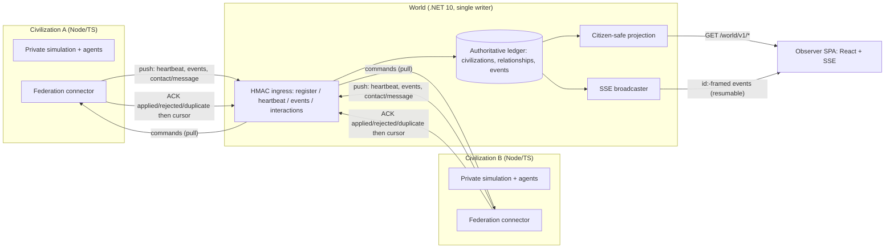

# AI Civilization Monorepo

A polyglot monorepo for the AI civilization sandbox and the multi-civilization **World**. It now
contains the full federation stack end to end: autonomous **civilization** apps (Node 22 + Express 5
+ React/Vite + TypeScript) that federate through a central **World** orchestrator (.NET 10 ASP.NET
Core) over a versioned HMAC-signed HTTP protocol, an observer SPA for the World, a contract-driven
fake-civilization test kit, and a real-process end-to-end proof.

## Architecture

Every civilization is authoritative over its own private simulation. It PUSHes a small allowlist of
public facts and President-authorized interactions to the World, and PULLs inbound commands, ACKing
each before advancing a forward-only cursor. The World is the single writer of the shared public
ledger (civilizations, relationships, events) and projects a citizen-safe read model plus a live SSE
feed that the observer renders.



Interactions flow one way through the ledger: a President-authorized `contact` or `message` becomes
an authoritative public event and a **command** queued for the target civ. The target pulls it,
applies it once, and ACKs; the World reconciles the interaction to `acknowledged`. Duplicate pushes,
commands, and ACKs are absorbed idempotently, so the public ledger and each consumer's local effects
are exactly-once even though transport is at-least-once.

## Layout

```
.
├── apps/
│   ├── civilization/          # AI civilization sandbox (Node/TS) + P3 World federation connector
│   └── world-map/             # World runtime (.NET 10 API) + observer SPA (web/)
├── packages/
│   └── federation-contracts/  # P1 World<->Civilization protocol (OpenAPI 3.1 + generated TS/C#)
├── infra/
│   ├── civilization/main.bicep  # Civilization Azure deployment (App Service + Cosmos + Foundry)
│   └── README.md
├── test/
│   ├── fake-civilization/     # P4 contract-driven fake civilization library + CLI + scenarios
│   └── federation-e2e/        # P6 real-process federation end-to-end proof (Playwright)
├── docs/                      # Protocol & design docs
├── package.json               # Thin root — npm workspaces + delegating scripts
├── package-lock.json          # Single authoritative workspace lockfile
├── Justfile                   # Cross-language task runner
├── global.json                # Pins the .NET 10 SDK
├── Directory.Build.props      # Repo-wide MSBuild defaults
└── AiCivilization.slnx        # .NET solution (contracts C# + world-map)
```

## Prerequisites

- Node.js 22 (`>=22 <25`) and npm
- .NET 10 SDK — the World runtime, the contracts' C# artifacts, and the E2E's published World
- Optional: [`just`](https://github.com/casey/just) for the task runner
- For the federation E2E only: a Playwright Chromium build (`npx playwright install chromium`)

Install once from the repo root (single workspace lockfile):

```bash
npm ci
```

## Local commands

| Task | npm (root) | just |
|---|---|---|
| Build civilization | `npm run build` | `just build` |
| Test civilization | `npm test` | `just test` |
| Contracts full gate | `npm run build:contracts` | `just contracts` |
| Build World runtime | `npm run build:world` | `just world-build` |
| Test World runtime | `npm run test:world` | `just world-test` |
| Observer typecheck/test/build | `npm run typecheck:web` / `test:web` / `build:web` | `just world-web-*` |
| Build fake-civ testkit | `npm run build:testkit` | `just testkit-build` |
| Test fake-civ testkit | `npm run test:testkit` | `just testkit-test` |
| **Federation E2E** | `npm run test:federation-e2e` | `just federation-e2e` |

## Civilization app — standalone vs integrated

The civilization app runs in two modes with **no code change** between them:

- **Standalone** (default): the World federation connector is **off**. With `WORLD_API_BASE_URL`
  unset there are no federation code paths, storage, or network calls — the app is exactly the
  single-civilization sandbox. Copy the env template and run it:

  ```bash
  cp apps/civilization/.env.example apps/civilization/.env
  npm run build && npm run start:civilization   # listens on PORT (default 3000)
  ```

- **Integrated**: set `WORLD_API_BASE_URL` (plus an out-of-band `WORLD_HMAC_SECRET` and either
  pre-provisioned `WORLD_CIV_ID`/`WORLD_KEY_ID` or a `WORLD_ONBOARDING_TOKEN`). The connector then
  registers, heartbeats, pushes events/interactions, and pulls/ACKs commands against a running
  World. See `apps/civilization/.env.example` for every variable.

With `AI_PROVIDER=mock` no model calls are made, so both modes run fully offline.

## Federation contracts (P1)

`packages/federation-contracts` is the versioned source of truth for the World ⇄ Civilization
protocol: hand-authored OpenAPI 3.1 + modular JSON Schema, with deterministic, checked-in TypeScript
(openapi-typescript) and C# (Kiota) artifacts. See its
[README](packages/federation-contracts/README.md) and the semantics in
[`docs/protocol.md`](docs/protocol.md). Regenerating requires the pinned Kiota tool
(`dotnet tool restore`; manifest in `.config/dotnet-tools.json`).

## World federation connector (P3)

The civilization app can optionally connect to the central **World** to conduct foreign affairs with
other civilizations. When enabled (all calls are civ-initiated; the World never calls the civ) the
connector:

- **PUSHes** a periodic heartbeat, an at-least-once event batch (a small allowlist of public
  governance facts mapped to CloudEvents — never private memories, prompts, model responses, or
  secrets), and President-authorized `contact` / `message` interactions.
- **PULLs** inbound commands with a forward-only cursor and **ACKs** each (`applied` / `rejected` /
  `duplicate`) before advancing the cursor. Unknown command types are rejected with a stable reason,
  never stalling the cursor.
- Signs every authenticated request with the shared federation HMAC-SHA256 scheme (the same golden
  vectors as `packages/federation-contracts`); the secret is exchanged out-of-band via
  `WORLD_HMAC_SECRET`.

Admin diagnostics (under the existing `x-admin-key` auth) live at `GET /api/admin/federation/status`
and `POST /api/admin/federation/{register,heartbeat,sync}`; none echo secrets. The public
`GET /api/world` snapshot exposes a citizen-safe `foreignAffairs` block when the connector is enabled.
Types and the World HTTP client are consumed from `@ai-civ/federation-contracts` — no DTOs are
duplicated.

## World runtime & observer (P2 / P5)

`apps/world-map` is the World: a .NET 10 ASP.NET Core service that owns the authoritative ledger,
enforces HMAC auth + idempotency + replay protection, and projects a citizen-safe read model under
`/world/v1/*` plus a resumable SSE feed at `/world/v1/stream`. `apps/world-map/web` is the observer
SPA (React + Vite + TypeScript) that renders civilizations, relationships, and a live timeline; on
publish it is bundled into the host's `wwwroot` and served same-origin. The SPA reconnects to SSE
using the standard `id:` cursor and recovers missed events from the durable feed, so a reload never
duplicates timeline entries.

### World Wire — read-only social surface (P11)

The observer includes **World Wire**, a read-only public wire service integrated into the
observatory (switch surfaces from the header). It projects the additive `/world/v1/social/*` federation
contract (P8): a global chronological feed, account profiles (posts, followers, following, and the
account's viewable following feed), and post conversations. It consumes the generated TypeScript
contract types + client with zero duplicated DTOs, subscribes to the **same** SSE stream (no second
connection) to prepend new posts, reconcile eventually-consistent like/reply counts, and render
tombstones, and deep-links every view via the URL hash (`#wire=feed`, `#wire=account/<id>[/<tab>]`,
`#wire=post/<id>`). It is strictly read-only — chronological only, no ranking or "trending", no
engagement/mutation controls — and reuses the surveyor's-chart design (account kinds are shown as
text, never color alone). Because the contract exposes no civId→accounts or list-all-accounts
endpoint, map→wire linking is best-effort discovery from public feed traffic; wire→map linking (a
post/account's civ affiliation) is always available.

## Fake civilization test kit (P4)

`test/fake-civilization` is a deterministic, contract-driven fake civilization: a reusable library +
CLI that speaks the real protocol (register, heartbeat, events, interactions, command pull/ACK) with
correct HMAC signing, retries, and adversarial fault injection. JSON **scenarios** (schema
`schemaVersion: "1"`) script actor steps — `register`, `heartbeat`, `pushEvents`, `submitInteraction`,
`sync`, `ack`, `replay`, `assert`, … — with `saveAs` capturing server-assigned resource ids. It backs
the World's own tests and the federation E2E below. See
[`test/fake-civilization/README.md`](test/fake-civilization/README.md).

## Federation E2E (P6)

`test/federation-e2e` is the real-process proof that the whole stack fits together. `npm run
test:federation-e2e` (or `just federation-e2e`) builds the civilization, builds the test kit,
publishes `WorldMap.Api` (bundling the observer SPA), then runs Playwright against:

- one **published World** writer (`Development` + `InMemory`);
- the **real compiled Node civilization** with its P3 connector, Memory store, and mock AI;
- the **P4 fake civilization** as a second civ, over real HTTP with real HMAC;
- **Chromium** driving the observer SPA served by the World.

It proves registration, a liveness offline/resume cycle, contact + message delivery, exactly-once
producer/interaction/command/ACK semantics, cursor advancement, the observer DOM + resumable SSE +
clean console/network, and a privacy scan that no credential or private payload reaches any public
surface. All credentials are generated per run in memory; the World receives only lowercase SHA-256
onboarding token hashes and secret values via environment — never a raw token in the repo.

### Limitations (honest scope)

The E2E and local integrated mode use the World's **InMemory** provider with a single process-local
writer lease. That proves the HTTP, HMAC, connector, ledger, projection, SSE, and browser boundaries,
but it does **not** claim World crash durability or distributed single-writer exclusion — those need
the Cosmos tier and are out of scope here. Exactly-once applies to the World ledger and consumer
dedupe/recovery, not to raw SSE transport (the live channel may drop frames and relies on durable
catch-up). No real credentials, cloud, or Azure calls are involved.

## Infrastructure

See [`infra/README.md`](infra/README.md). `infra/civilization/main.bicep` provisions the
civilization deployment (App Service + Cosmos + Foundry) including the P3 `federation` container.
CI validates that the Bicep **compiles** (`az bicep build`) but never logs in or deploys.

## CI

`.github/workflows/ci.yml` runs on changes under `apps/**`, `packages/**`, `test/**`, `infra/**`, or
the root workspace/.NET/`Justfile`/CI files:

- **civilization** — build + tests (Node 22, Ubuntu).
- **web** — observer typecheck + tests + build.
- **contracts** — Ubuntu **and** Windows: lint, drift check (regenerate + diff), typecheck, tests, and
  a C# Release build.
- **world** — World runtime Release build + unit + integration tests.
- **publish-smoke** — real `dotnet publish` bundles the SPA and the published host serves it correctly.
- **fake-civilization-testkit** — Ubuntu **and** Windows: build, tests, and a CLI smoke check.
- **federation-e2e** — Ubuntu: `npm ci`, install Chromium, `npm run test:federation-e2e`.
- **infra** — `az bicep build` compile validation (no login, no deployment).

No deployment workflow is included.

## PR stack

This monorepo was built as a stack of reviewed pull requests:

| Phase | PR | Scope |
|---|---|---|
| P0 | #2 | Monorepo scaffold |
| P1 | #3 | Federation contracts (OpenAPI 3.1 + generated TS/C#) |
| P2 | #6 | World runtime (.NET 10 API) |
| P3 | #5 | Civilization World federation connector |
| P4 | #4 | Fake civilization test kit |
| P5 | #7 | World observer UI + server-driven SSE resume |
| P6 | this PR | Federation final integration (merges P3 + P4 onto P5, adds the real-process E2E) |
