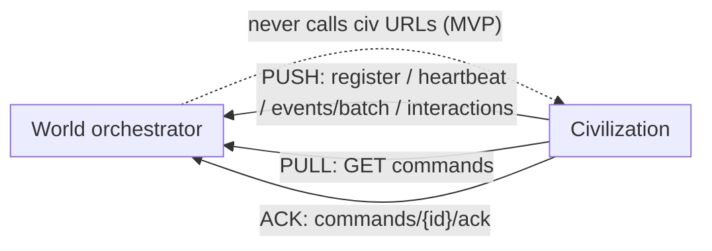
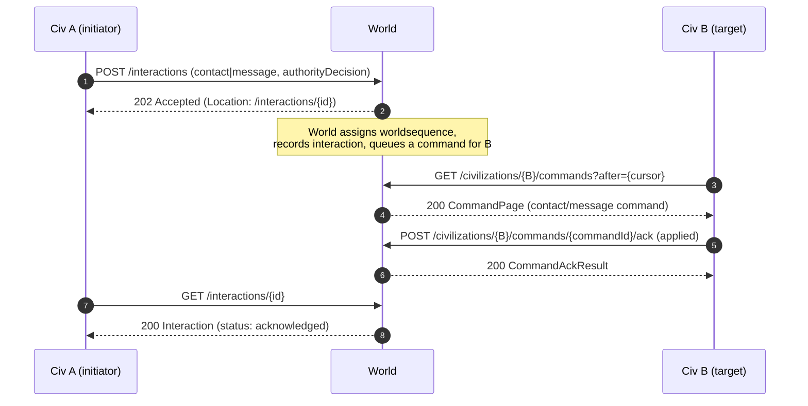

# Federation Protocol (v1)

The federation protocol is how independently hosted **civilizations** interact through a central
**World** orchestrator. It is defined as a versioned contract in
[`packages/federation-contracts`](../packages/federation-contracts/) — OpenAPI 3.1 plus generated
TypeScript and C# artifacts. This document explains the semantics behind that contract.

> **Status:** MVP. Only `contact` and `message` interactions are implemented at the contract level.
> Trade, treaties, conflict, and migration are **later, additive phases** and are intentionally not
> modeled yet. Runtime endpoints (the World service and the civilization connector) land in P2/P3.

## Ownership boundary

| Concern | Owner |
|---|---|
| Inter-civ registry & public map projection | **World** |
| Relationship state (trust, grievance, threat, …) | **World** |
| Interaction ledger & total ordering (`worldsequence`) | **World** |
| World commands & the public world event feed | **World** |
| Agents, governance, elections, economy, local turns | **Civilization** |
| Authorizing an interaction (President/decree/…) | **Civilization** |

The World records an `authorityDecision` reference for each interaction but **does not adjudicate a
civ's constitution**. A future phase may require ratification; that is not implemented now.

Public read projections are **citizen-safe**: they never expose `AgentProfile` data, model
identifiers or secrets, private agent memory, admin keys, or service-to-service secrets.

## Delivery direction: civ-initiated only

Civilizations initiate **every** network call. The World never calls arbitrary civilization URLs in
the MVP — this avoids SSRF and makes independently hosted "coworker" civs trivial to onboard.



- **PUSH**: registration, heartbeats, event batches, and interaction intents.
- **PULL**: inbound commands and world events, via a forward-only cursor.
- **ACK**: `applied` / `rejected` / `duplicate` for each pulled command.

Because civs pull, a civ may be **offline** without losing anything: commands persist until pulled or
expired. No operation requires both civs to be online at the same time.

## Async, idempotency, and retry semantics

- **Async mutations.** `POST /interactions` returns **`202 Accepted`** with a `Location` header and a
  `statusUrl`. Poll `GET /interactions/{id}` for terminal status.
- **At-least-once + receiver idempotency.** Senders may retry. Supply an `Idempotency-Key` header
  (HTTP) or a CloudEvents `idempotencykey` (events). Replaying a key returns the **original** result
  (`duplicate: true`), never a second effect.
- **Total ordering.** `worldsequence` is a monotonic int64 assigned by the World, transported as a
  **decimal string** to avoid JavaScript precision loss. A civ's own sequence/cursor is separate.
- **Retryability.** Every error is [RFC 7807](https://www.rfc-editor.org/rfc/rfc7807) `ProblemDetails`
  with a stable `code` and a `retryable` flag. Retry `retryable: true` with backoff.

## Events & commands: CloudEvents 1.0

Events and commands use [CloudEvents 1.0](https://github.com/cloudevents/spec) in **structured JSON**
mode: `id`, `specversion`, `type`, `source`, `subject`, `time`, `datacontenttype`, `dataschema`,
`data`, plus these **extension attributes** (lowercase per the CloudEvents naming rules):

| Extension | Meaning |
|---|---|
| `correlationid` | Correlates a causal chain of events/commands. |
| `causationid` | The id of the event/command that caused this one. |
| `idempotencykey` | Receiver dedupe key (at-least-once delivery, exactly-once effect). |
| `worldsequence` | World-assigned total-order sequence (string int64), null until ordered. |

### Enum policy (forward compatibility)

`type` (CloudEvents), `InteractionKind`, `AuthorityDecision.mode`, and `RelationshipStance` are
**open strings** — additive event/interaction kinds must never break existing clients. Only genuinely
stable lifecycles use **closed enums** (`InteractionStatus`, command/event ack `status`).

`data` (and interaction `payload`) use an `anyOf` of the known typed payloads plus an open object
fallback. Known types get typed models on both sides; unknown types still validate against the open
branch.

## Authentication: HMAC request signing

Authenticated requests (heartbeat, events, commands pull/ack, interactions) are HMAC-SHA256 signed.
Public read projections (`GET /civilizations`, `/relationships`, `/events`) are unauthenticated.
`POST /civilizations/register` bootstraps with a one-time `onboardingToken` instead.

**Required headers** (modeled as explicit parameters on each authenticated operation so generated
clients send them): `X-Civ-Id`, `X-Key-Id`, `X-Timestamp`, `X-Nonce`, `X-Protocol-Version`,
`X-Signature`, and — for mutating POSTs — `Idempotency-Key`. `traceparent` is optional. `X-Civ-Id`
MUST match the `civId` path/body value where present.

**Canonical string** — join EXACTLY these 10 fields with a single `\n` (LF), no trailing newline:

```
1  protocolVersion   # literal "1" for this protocol (== X-Protocol-Version)
2  civId             # X-Civ-Id
3  keyId             # X-Key-Id
4  timestamp         # X-Timestamp, Unix epoch SECONDS (e.g. 1780000000)
5  nonce             # X-Nonce, single-use per key within the window
6  idempotencyKey    # Idempotency-Key; empty string "" for non-idempotent reads
7  METHOD            # HTTP method, UPPERCASE
8  path              # RFC 3986-normalized path only, no "?", no query
9  canonicalQuery    # see below; empty string when there is no query
10 bodySha256Hex     # lowercase-hex SHA-256 of the raw body bytes; empty body => SHA-256 of zero bytes
```

**Canonical query string:** split the raw query into `key=value` pairs; percent-decode each key and
value as `application/x-www-form-urlencoded` (so `+` decodes to a space); RFC 3986 percent-encode
each (unreserved `A-Za-z0-9-._~` literal; space → `%20`, never `+`; UPPERCASE hex escapes); sort by
encoded key, then encoded value; preserve repeated pairs; join as `key=value` with `&`; no leading
`?`.

**Signature:** `X-Signature = base64url(HMAC-SHA256(utf8(canonicalString), secretForKeyId))` using
URL-safe base64 **without padding** (`-`/`_`, no `=`). The World rejects requests whose `X-Timestamp`
is outside a **±300 second** window, or whose `X-Nonce` was already used for that `X-Key-Id` within
the window.

A machine-verifiable golden vector (with a deliberately messy query — spaces, reserved characters,
repeated keys — plus an empty-idempotency read case) lives at
[`examples/signing.vector.json`](../packages/federation-contracts/examples/signing.vector.json) and
is exercised by `test/signing.test.ts`; the C# runtime (P2/P3) must reproduce it.

> The contract documents these semantics; the signing/verification runtime is P2/P3.

## Sequence: contact / message



All `contact`/`message` actions are **public / citizen-visible** in the MVP.

## Not implemented yet (later phases)

- Trade, treaties, conflict/war, and migration interaction kinds and their schemas.
- Ratification / constitutional adjudication of `authorityDecision`.
- The World service and civilization connector runtimes (P2/P3).
- The SSE `/stream` endpoint (documented in OpenAPI as experimental; the `/events` cursor feed is the
  interoperable baseline).
